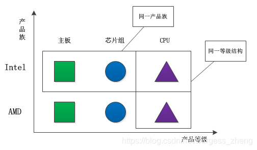

# 创造型设计模式

```text
对象的创建会消耗掉系统的很多资源，所以单独对对象的创建进行研究，从而能够高效地创建对象就是创建型模式要探讨的问题
```

常见的设计模式分为以下类别：
```text
0. 简单工厂模式（Simple Factory） #说明：严格来说，简单工厂模式不是GoF总结出来的23种设计模式之一。
1. 工厂方法模式（Factory Method）
2. 抽象工厂模式（Abstract Factory）
3. 创建者模式（Builder）
4. 原型模式（Prototype）
5. 单例模式（Singleton）
```

## 简单工厂模式（Simple Factory）：
```text
简单工厂模式属于创建型模式，又叫做静态工厂方法（Static Factory Method）。简单工厂模式是由一个工厂对象决定创建哪一种产品类实例。在简单工厂模式中，可以根据参数的不同返回不同类的实例。简单工厂模式专门定义一个类来负责创建其他类的实例，被创建的实例通常都具有共同的父类。简单工厂模式是工厂模式家族中最简单实用的模式，可以理解为不同工厂模式的一个特殊实现。
```
- 在简单工厂模式中，有一个工厂类负责创建多个不同类型的对象。该工厂类通常包含一个公共的静态方法，该方法接受一个参数，用于指示要创建的对象类型，然后根据该参数创建相应的对象并返回给客户端。

- 简单工厂模式可以隐藏对象创建的复杂性，并使客户端代码更加简洁和易于维护。但它也有一些缺点，例如如果需要添加新的对象类型，则必须修改工厂类的代码。同时，该模式也可能破坏了单一职责原则，因为工厂类不仅负责对象的创建，还负责了判断要创建哪个对象的逻辑。

- 简单工厂模式通常被用于创建具有相似特征的对象，例如不同类型的图形对象、不同类型的数据库连接对象等。

## 工厂模式（Factory Method）
```text
通常情况下，工厂方法模式使用一个接口或抽象类来表示创建对象的工厂，然后将具体的创建逻辑委托给子类来实现。这样可以使代码更加灵活，因为在运行时可以选择要实例化的对象类型。
```

工厂方法只是把简单工厂的内部逻辑判断移到了客户端进行

基本实现：
- 定义一个接口或抽象类来表示要创建的对象。
- 创建一个工厂类，该类包含一个工厂方法，该方法根据需要创建对象并返回该对象。
- 创建一个或多个具体的子类，实现工厂接口并实现工厂方法来创建对象。

优点：
- 代码更加灵活，轻松添加新的子类来创建不同的对象类型，而无需更改现有的代码
- 解耦，使对象的创建逻辑和使用代码分离
- 常用框架和库中，可以扩展框架和库的功能，无需修改源码

## 抽象工厂模式（AbstractFactory）
```text
抽象工厂模式的主要目的是封装一组具有相似主题的工厂，使客户端能够以一种与产品实现无关的方式创建一组相关的产品。抽象工厂模式提供了一个抽象工厂类和一组抽象产品类，具体工厂和具体产品类由它们的子类来实现。

                      +---------------------+
                      |   AbstractFactory   |
                      +---------------------+
                      | create_product_A()  |
                      | create_product_B()  |
                      +---------------------+
                               /   \
                              /     \
                             /       \
                            /         \
         +----------------+           +----------------+
         |  ConcreteFactory1 |         |  ConcreteFactory2 |
         +-----------------+           +-----------------+
         | create_product_A()|         | create_product_A()|
         | create_product_B()|         | create_product_B()|
         +------------------+           +------------------+
                    / \                            / \
                   /   \                          /   \
                  /     \                        /     \
    +--------------+   +--------------+  +--------------+   +--------------+
    |  ProductA1  |   |  ProductA2  |  |  ProductB1  |   |  ProductB2  |
    +--------------+   +--------------+  +--------------+   +--------------+


```
抽象工厂模式与工厂方法模式的最大区别就在于，工厂方法模式针对的是一个产品等级结构；而抽象工厂模式则需要面对多个产品等级结构。


缺点：

如果需要给整个产品族添加一个新的产品，那么就需要修改抽象工厂，这样就会导致修改所有的工厂实现类。

## 单例模式（Singleton）

单例模式可以使用多种不同的实现方式，但它们的基本原理是相同的。通常，单例模式使用一个私有构造函数来确保只有一个对象被创建。然后，它提供了一个全局点访问该对象的方法，使得任何代码都可以访问该对象，而不必担心创建多个实例。

具体来说，单例模式通常通过以下几个步骤实现：
- 创建一个私有构造函数，以确保类不能从外部实例化。
- 创建一个私有静态变量，用于存储类的唯一实例。
- 创建一个公共静态方法，用于访问该实例。

优缺点：
- 单例模式可以有效地避免重复的内存分配，特别是当对象需要被频繁地创建和销毁时。另外，单例模式还提供了一种简单的方式来控制全局状态，因为只有一个实例存在，可以确保任何代码都在同一个对象上运行。
- 然而，单例模式可能导致线程安全问题。如果多个线程同时尝试访问单例实例，可能会导致竞争条件。因此，在实现单例模式时需要格外小心，并考虑到线程安全问题。

## 建造者模式（Builder）
```text
将一个复杂对象的构建与它的表示分离，使得同样的构建过程可以创建不同的表示。

建造者模式（Builder）是一种创建型设计模式，它允许我们按照特定顺序组装一个复杂的对象。建造者模式将对象的构造过程分解为多个步骤，每个步骤都由一个具体的构造者来完成。这样，客户端可以根据需要使用不同的构造者来构建不同的对象，而不必知道构造过程的具体细节。
```

需要注意的是，在实际应用中，建造者模式常常会和其他设计模式一起使用，比如工厂方法模式和单例模式。此外，建造者模式还常常被用于构建复杂的 DOM 结构和 XML 文档。

## 原型模式（Prototype）
```text
它允许通过复制现有对象来创建新对象，而不是通过实例化类来创建对象。原型模式允许我们创建一个原型对象，然后通过克隆这个原型对象来创建新的对象，从而避免了重复的初始化操作。
```
- 在 Python 中，可以使用 copy 模块中的 copy() 和 deepcopy() 函数来实现原型模式。
- copy() 函数执行的是浅复制，它复制对象本身，但不复制对象引用的内存空间，因此如果原型对象中包含可变对象（如列表、字典等），那么新对象和原型对象将共享这些可变对象。
- deepcopy() 函数则执行深复制，它会递归地复制对象及其引用的所有对象，因此新对象和原型对象不会共享任何对象。


